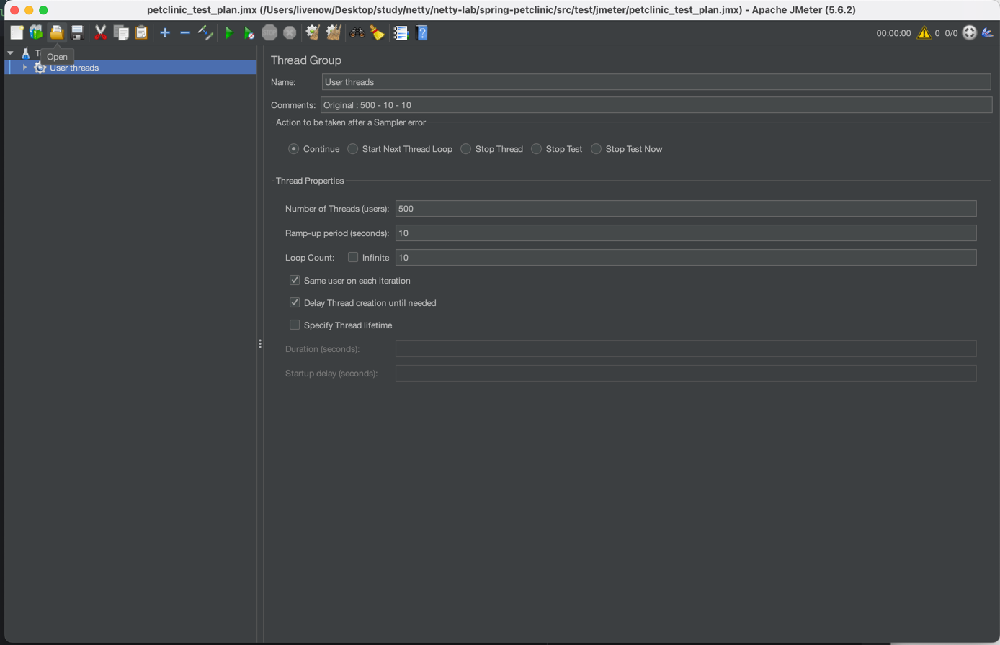
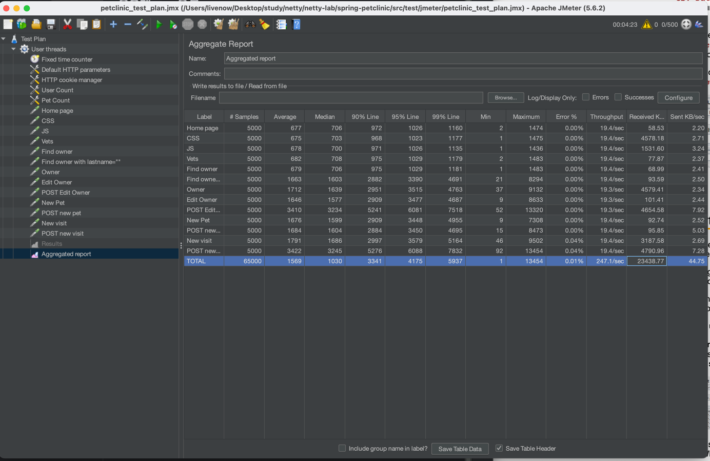

# PetClinic 애플리케이션을 동기(sync) 방식에서 비동기(async) 방식으로  변경하자!

## 성능테스트 방법
[Jmeter](https://jmeter.apache.org/usermanual/get-started.html)를 사용하여 테스트한다. 
### script
```java
  /spring-petclinic/src/test/jmeter $ jmeter -t petclinic_test_plan.jmx
```
### 실행 환경 


### 결과확인


## 결과 
### as-is 

### to-be

## 변경 기술
| 주제           | as-is | to-be       |
|--------------|-------|-------------|
| Web          | org.springframework.boot:spring-boot-starter-web    |             |
| DB           |     |  |
